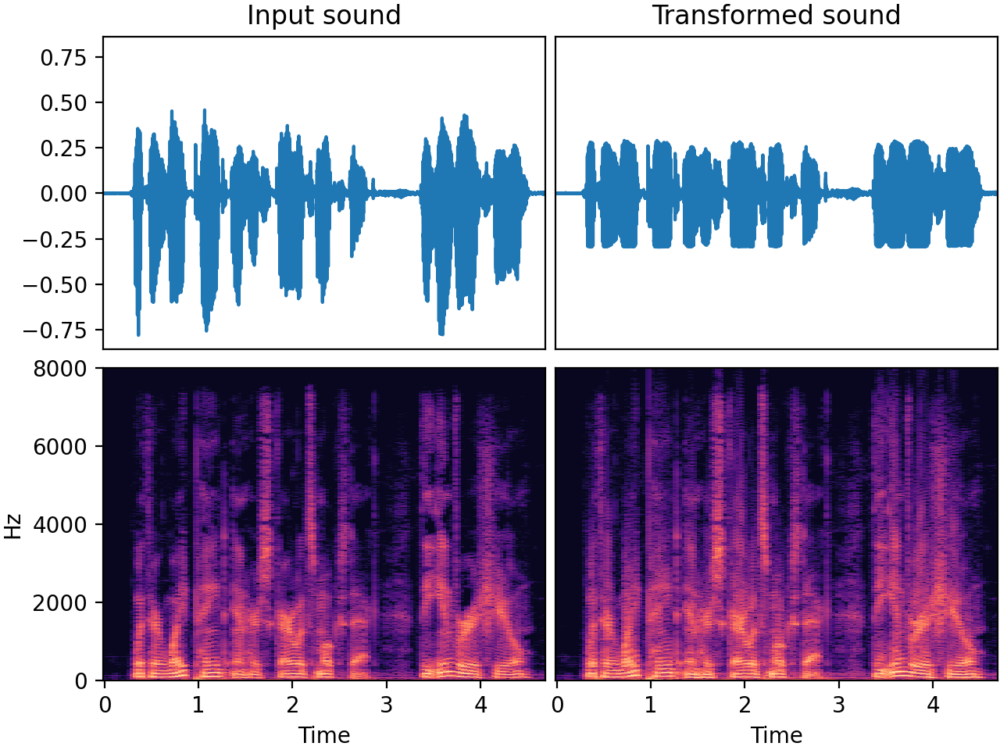

# `TanhDistortion`

_Added in v0.19.0_

Apply tanh (hyperbolic tangent) distortion to the audio. This technique is sometimes
used for adding distortion to guitar recordings. The tanh() function can give a rounded
"soft clipping" kind of distortion, and the distortion amount is proportional to the
loudness of the input and the pre-gain. Tanh is symmetric, so the positive and
negative parts of the signal are squashed in the same way. This transform can be
useful as data augmentation because it adds harmonics. In other words, it changes
the timbre of the sound.

See this page for examples: [http://gdsp.hf.ntnu.no/lessons/3/17/](http://gdsp.hf.ntnu.no/lessons/3/17/)

## Input-output example

In this example we apply tanh distortion with the "distortion amount" (think of it as a knob that goes from 0 to 1) set to 0.25



| Input sound                                                                             | Transformed sound                                                                             |
|-----------------------------------------------------------------------------------------|-----------------------------------------------------------------------------------------------|
| <audio controls><source src="../TanhDistortion_input.flac" type="audio/flac"></audio> | <audio controls><source src="../TanhDistortion_transformed.flac" type="audio/flac"></audio> |

## Usage example

```python
from audiomentations import TanhDistortion

transform = TanhDistortion(
    min_distortion=0.01,
    max_distortion=0.7,
    p=1.0
)

augmented_sound = transform(my_waveform_ndarray, sample_rate=16000)
```

## TanhDistortion API

[`min_distortion`](#min_distortion){ #min_distortion }: `float` • range: [0.0, 1.0]
:   :octicons-milestone-24: Default: `0.01`. Minimum "amount" of distortion to apply to the signal.

[`max_distortion`](#min_distortion){ #min_distortion }: `float` • range: [0.0, 1.0]
:   :octicons-milestone-24: Default: `0.7`. Maximum "amount" of distortion to apply to the signal.

[`p`](#p){ #p }: `float` • range: [0.0, 1.0]
:   :octicons-milestone-24: Default: `0.5`. The probability of applying this transform.
